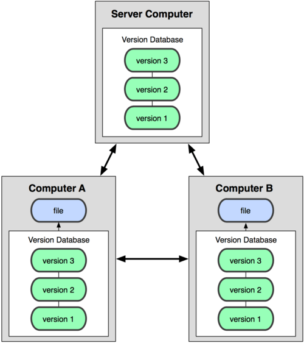

# Ch1. Git版本控制工具使用

## 從Git 版本控制到 Github雲端儲存庫

> 請先在電腦中下載並安裝好Git：[https://git-scm.com](https://git-scm.com)
>
> 若是使用Mac或Linux，也可以用以下指令安裝：
>
> 1.安裝Homebrew：
>
> ```bash
> $ /usr/bin/ruby -e "$(curl -fsSL https://raw.githubusercontent.com/Homebrew/install/master/install)"
> ```
>
> 2.利用Homebrew安裝git：
>
> ```bash
> $ brew install git
> ```

### 為何要使用版本控制\(Version Control System\)

**使用版本控制前常做這種蠢事：**

Project\_1、Project\_1\_Revised、Project\_1\_Small Revised、 Proejct\_1\_Final、Project\_1\_New Final、Project\_1\_Final2…

\(Final後還有Final、不斷增生的Final…\)

哪個檔案是哪個，常常搞不清楚差別

要解決以上困擾，就可以使用版本控制工具！！！

### 什麼是版本控制工具


版本控制就像遊戲的存檔進度功能，可以存取某時點的檔案狀態。

### 為何選擇Git?

* **分散式系統**

版本控制工具分為**分散式**與**集中式**

集中式：

使用者一定要連網才能進行版控


分散式：

使用者不會只取得到最後一版的檔案，而是所有版本。



* **GITHUB是全世界最受歡迎的程式碼雲端儲存庫**
* **提交速度快**

