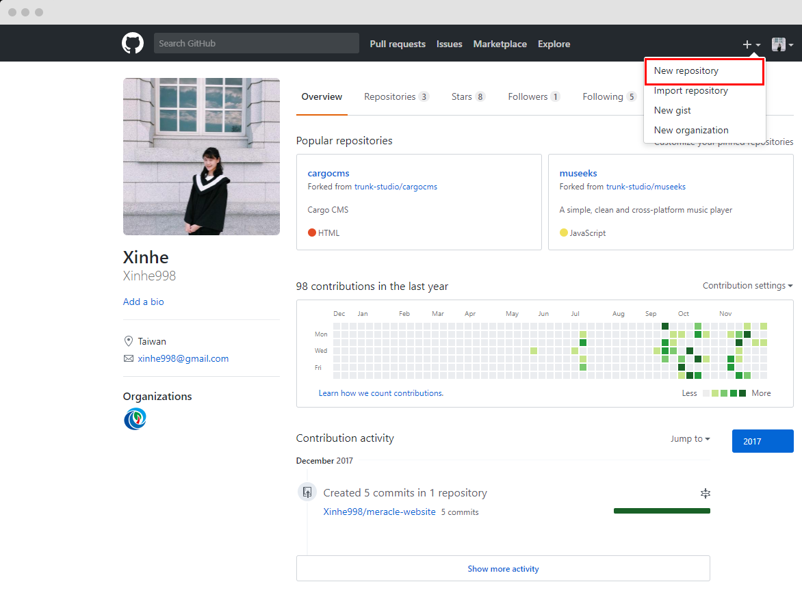
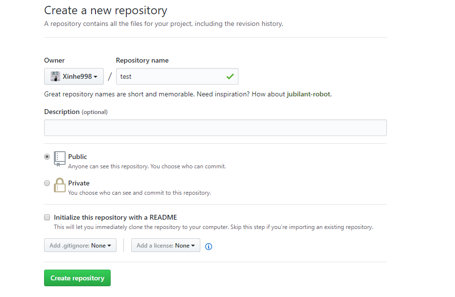
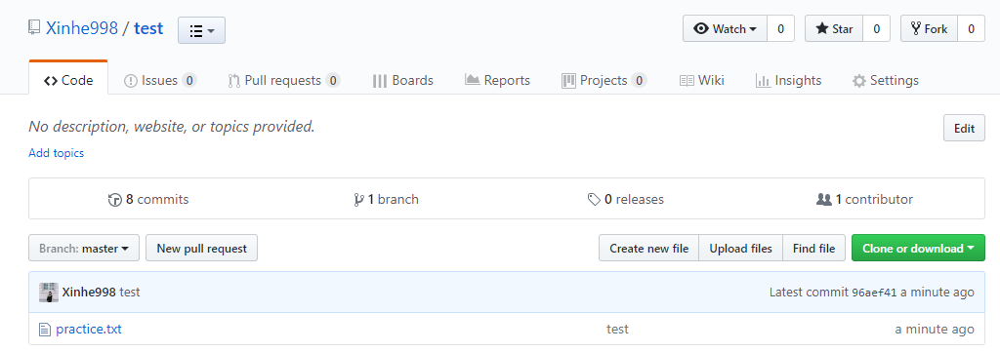

# Git 推上 Github 囉

前面幾章我們一直在本地端辛苦的操作版本控制，但要如何讓其他人也能取得到我的資料，並一同協作編輯呢?

這時候就要建立遠端儲存庫～

註冊好Github帳號後，建立New repository。





輸入repo名稱後建立。

這樣遠端儲存庫就建立好了，讓我們試著把本地端已提交的資料推到Github上吧！每一個帳號的每一個repo都會有自己專屬的git連結


我們須在本地端把剛剛得到的連結加進這個專案的遠端庫

```bash
$ git remote add origin【遠端庫代稱】 https://github.com/Xinhe998/test.git【網址改成自己的連結哦】
```

列出擁有的遠端庫

```bash
$ git remote -v
```


當然一個專案也可以擁有多個遠端庫


然後使用 `git push` 指令將已提交的檔案推到Github

```bash
＄ git push origin【遠端庫代稱】 master【分支名】
```


push成功後可以看到以上訊息！

查看Github該repo內，可以發現本地端的所有commit資料都被push上來囉～

## Git多人協作

當需要和其他人一同協作同一專案時，我們可以至該專案複製其git連結並clone到自己本地端


```bash
$ git clone https://github.com/Xinhe998/test.git【複製到的連結】
```

clone下來的專案，將擁有完整檔案與所有開發人員完整的commit資料。

假若他人又更動了檔案資料，並Push到Github上，我該如何取得最新版本呢?

```bash
$ git pull origin master
```

下達 `git pull` 指令，就可以完整取得最新更動的檔案資料囉～

> p.s. 其實git pull 指令包含了下載與將遠端分支合併到本地分支這兩個動作，
>
> 如果只想要下載最新版本而不執行"合併"這個動作，可以利用 `git fetch` 指令達成。

