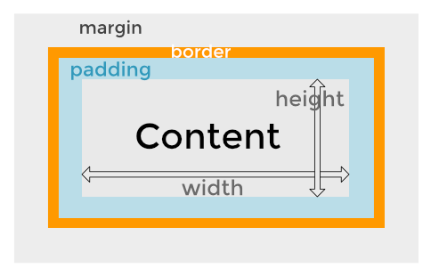

# CSS排版須知: Box Model

CSS 排版有一個很重要的觀念： Box Model 。

它描述了元素之間的彼鄰關係，同時也左右了我們是否能夠成功透過 CSS ，完成整個頁面的呈現。

每一個元素我們都可視它為一個 Box（方塊）。

 一個 Box 由以下屬性組成：margin 、 padding 、 border 、 content 。

* padding :為留白，從內容向外開始算起，增加空間。
* border :為邊框，整體大小最外面的邊框。
* margin :為邊界，區塊與其他區塊的距離。

  ```text
  【padding/margin/border】: [上面值] [右邊值] [下面值] [左邊值];
  ```

  在這裡，順序非常重要，必須按照**順時針**設定。

  ```text
  【padding/margin/border】: [上下值] [左右值];
  ```

e.g.

```text
button { 
    border: none;
    background-color: grey;
    color: white;
    width: 200px;
    padding: 10px;
    margin: 50px;
}
```


一般我們指定的 width（寬度） 和 height（高度）是 content 的寬和高，而沒有包含 border 和 padding 。

| 屬性 | 說明 |
| :--- | :--- |
| height | 設置元素的高度。 |
| width | 設置元素的寬度。 |
| min-width | 設置元素的最小寬度。 |
| max-width | 設置元素的最大寬度。 |
| min-height | 設置元素的最小高度。 |
| max-height | 設置元素的最大高度。 |

