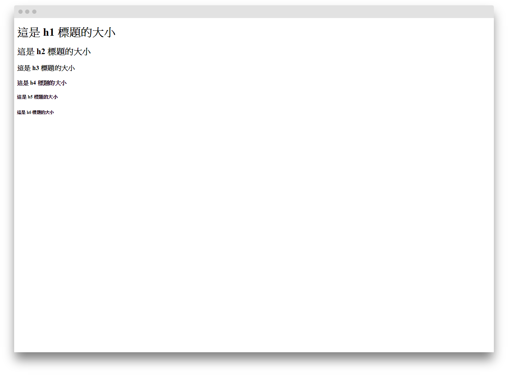
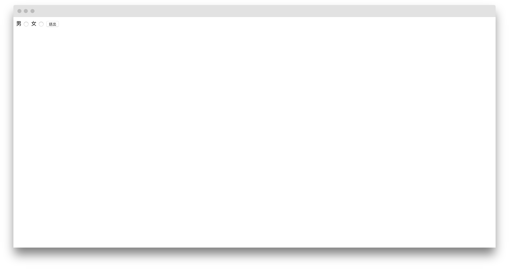

# 深入 HTML

開始之前，要請大家先在VSCode安裝一些好用套件：

### 1. **HTML Snippets**

提供一些常用的HTML片段程式碼。


### 2. Auto Close Tag

自動添加上閉合tag。


安裝好上述套件後，在VSCode新增一html檔案，輸入html5並按下Enter


可以發現 **HTML Snippets** 套件自動幫我們完成了html5的template，是不是超級方便^\_^

## head 頁面資訊

我們可以由剛剛產生的html5 template看到head區塊：

```markup
<title></title>
```

此標籤中的就是此網頁的標題，也就是您瀏覽器最左上面的標題，若沒設定則會顯示成此網頁的檔名。

```markup
<meta charset="UTF-8">
```

定義文件編碼。

```markup
<meta name="viewport" content="width=device-width, initial-scale=1">
```

W3C 在 HTML 制定了給手機網頁 Mobile Web 使用的 Viewport 螢幕解析度設定的語法。

viewport的作用是告訴瀏覽器，目前裝置有多寬\(或多高\)。

可以透過viewport來設定：

| 屬性 Attribute | 描述 Description |
| :--- | :--- |
| width | viewport寬度，通常設為device-width，用意是適應各家裝置的大小。 |
| initial-scale | 預設以多少倍的viewport來顯示。 |
| maximum-scale | 定義頁面縮放的最高倍率。 |
| user-scalable | 只有0與1兩個值，定義是否讓使用者自己調整viewport倍率。 |

更多html `<meta>` Tag用法：[https://www.w3schools.com/tags/tag\_meta.asp](https://www.w3schools.com/tags/tag_meta.asp)

```markup
<link href="css/style.css" rel="stylesheet">
```

引入CSS樣式表。

## 認識 html Tags

### div：用來標示一個網頁區塊，可以說是一個能夠將其他元素包起來的"容器"。

```markup
<div id="" class="">...</div>
```

### h1~h6：代表不同大小的標題

```markup
<h1>這是 h1 標題的大小</h1>
<h2>這是 h2 標題的大小</h2>
<h3>這是 h3 標題的大小</h3>
<h4>這是 h4 標題的大小</h4>
<h5>這是 h5 標題的大小</h5>
<h6>這是 h6 標題的大小</h6>
```



### p：段落

```markup
<p>你好嘛?</p>
```

### span：文字的區域

```markup
<span>你好嘛?</span>
```

### a：超連結

```markup
<a href="連結網址" target="連結目標" title="替代文字">...</a>
```

* target="\_blank"  在新視窗開啟
* target="\_self"  在原本的視窗開啟

### img：圖片

```markup

```

### input：輸入欄位

| 屬性Attribute | 描述 Description |
| :--- | :--- |
| type | 設定類型，可用的類型有: text、textarea、button、checkbox、date、email、file、password、number、color、submit ...... |
| value | 指定值給input標籤。 |
| placeholder | 提示文字。 |
| max | 最大字數。 |
| min | 最小字數。 |
| disabled | 禁止使用。 |

更多屬性請參考：[https://www.w3schools.com/tags/tag\_input.asp](https://www.w3schools.com/tags/tag_input.asp)

### ul、li：列表

```markup
<ul>
  <li>第一個項目</li>
  <li>第二個項目</li>
  <li>第三個項目</li>
</ul>
```

### table、caption、th、tr、td：表格

* th 為表頭
* tr 為一列
* td 為儲存格

  ```markup
  <table>
      <caption>表格標題</caption>
      <tr>
        <th>Firstname</th>
        <th>Lastname</th> 
        <th>Age</th>
      </tr>
      <tr>
        <td>Jill</td>
        <td>Smith</td> 
        <td>50</td>
      </tr>
      <tr>
        <td>Eve</td>
        <td>Jackson</td> 
        <td>94</td>
      </tr>
  </table>
  ```


### button：按鈕

```markup
<button>我是按鈕</button>
```

這是產生按鈕的第二種方法，第一種為`<input type="button" value="我是按鈕">`。

### hr：分隔線

```markup
<hr />
```

### br：換行

```markup
<br />
```

### form：表單

```markup
<form>
  <label for="boy">男</label>
  <input name="gender" type="radio" id="boy">
  <label for="girl">女</label>
  <input name="gender" type="radio" id="girl">
  <input type="submit" value="送出">
</form>
```



## id與class的區別

id是唯一性的、不可重複的。

class與id正好相反，class是可被拿來被重複使用的。

而二者的使用時機又是為何呢?

簡單的來說，若只要設定樣式的，則採用class來作設定\(如此可讓多個物件都使用同一種樣式\)，

若要透過Javascript或其它的程式語言，找尋物件時，就建議使用id來進行相互對應的動作。

