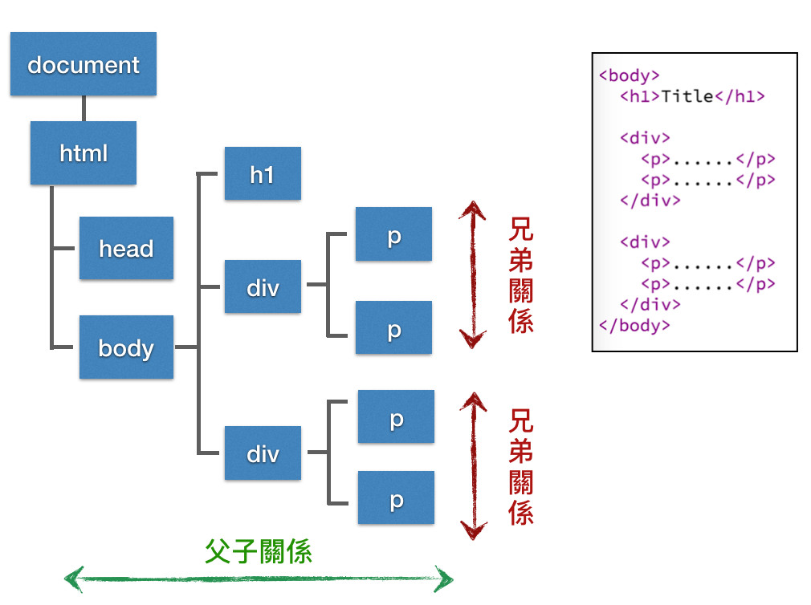

# 取得DOM元素節點

## DOM簡介

DOM的核心概念是將HTML於元素轉換成一顆節點樹，而每一個標籤就是一個一個節點（Nodes），**每一個節點皆為物件\(Object\)且擁有各自的屬性以及方法**，並且DOM以走訪的方式來存取HTML元素。


## JavaScript取得HTML元素

JavaScript要拿到HTML元素，就是利用上述DOM的方式取得節點物件，

JavaScript可以用以下幾種方式拿到DOM元素：

1. getElementById\(\)

```markup
<head>
    <script type="text/javascript">
        //alert元素id是title物件之標籤內的內容
        alert(document.getElementById("title").innerHTML())
    </script>
</head>
<body>
    <h1 id="title"> 我是Title </h1>
</body>
```

      2. getElementByTagName\(\)

```markup
<head>
    <script type="text/javascript">
        //alert元素標籤是h1的內容
        alert(document.getElementTagName("h1").innerHTML())
    </script>
</head>
<body>
    <h1 id="title"> 我是Title </h1>
</body>
```

     3. getElementByName\(\)  
         用法與getElementById\(\) 方法相似，但它是查詢元素的name 屬性，而不是id 屬性。

```markup
<head>
    <script type="text/javascript">
        //alert元素name是myInput的值
        alert(document.getElementName("myInput").value)
    </script>
</head>
<body>
    <input name="myInput" type="text" value="大家好" />
</body>
```

 4. getElementsByClassName\(\)

```markup
<head>
    <script type="text/javascript">
        //alert所有元素class是box的第一個物件之標籤內的內容
        alert(document.getElementsByClassName("box")[0].innerHTML)
    </script>
</head>
<body>
    <div class="box">box1</div>
    <div class="box">box2</div>
    <div class="box">box3</div>
</body>
```

 5. querySelector\(\) & querySelectorAll\(\)  
      用CSS Selector來取得「第一個」或「所有」符合條件的節點物件。

```markup
<head>
    <script type="text/javascript">
        //alert元素class是box的第一個物件之標籤內的內容
        alert(document.querySelector(".box").innerHTML)
        //元素class是box的所有物件集合（NodeList）
        document.querySelectorAll(".box")
    </script>
</head>
<body>
    <div class="box">box1</div>
    <div class="box">box2</div>
    <div class="box">box3</div>
</body>
```


## DOM節點間查找

因為DOM節點樹是分層的觀念，所以就會有父子關係和兄弟關係



* **childNodes**
* **firstChild**
* **lastChild**
* **parentNode**
* **previousSibling**
* **nextSibling**

## JavaScript操作HTML元素常用方法

| 方法 Method | 描述 Description |
| :--- | :--- |
| appendChild\(\) | 在節點內的最後添加子節點。 |
| createElement\(\) | 創造物件。 |
| click\(\) | 點擊此節點物件。 |
| focus\(\) | 聚焦此節點物件。 |
| innerHTML | 取得該節點內的HTHL。 |
| style | 設置或返回元素的CSS樣式屬性。 |
| setAttribute\(\) | 設定元素的指定屬性值。 |
| toString\(\) | 將元素轉型為字串。 |


